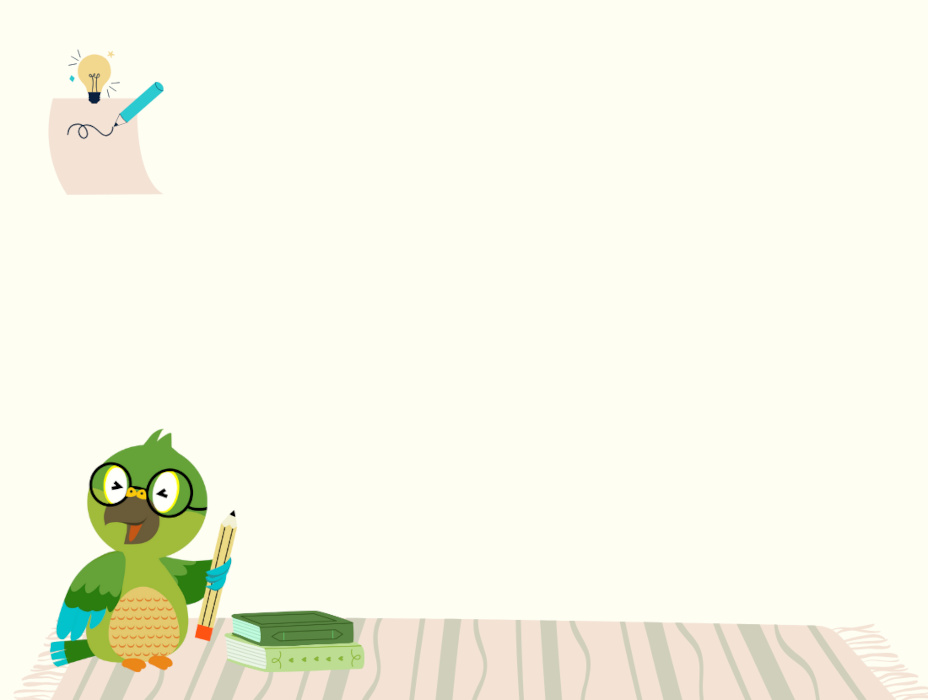
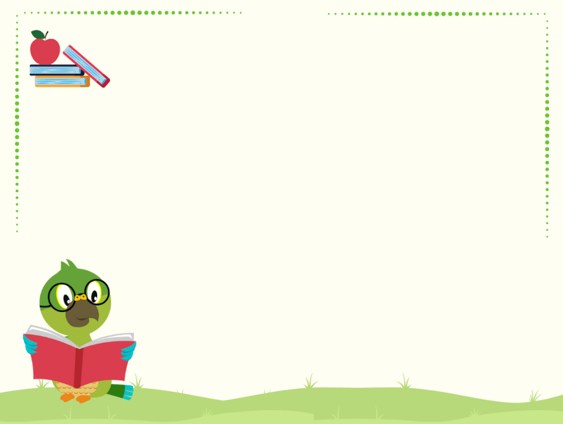
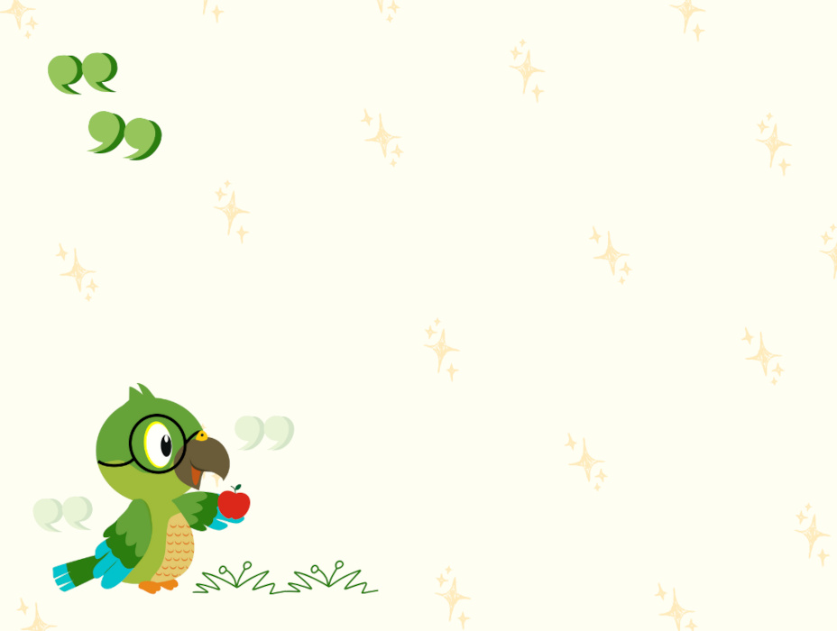
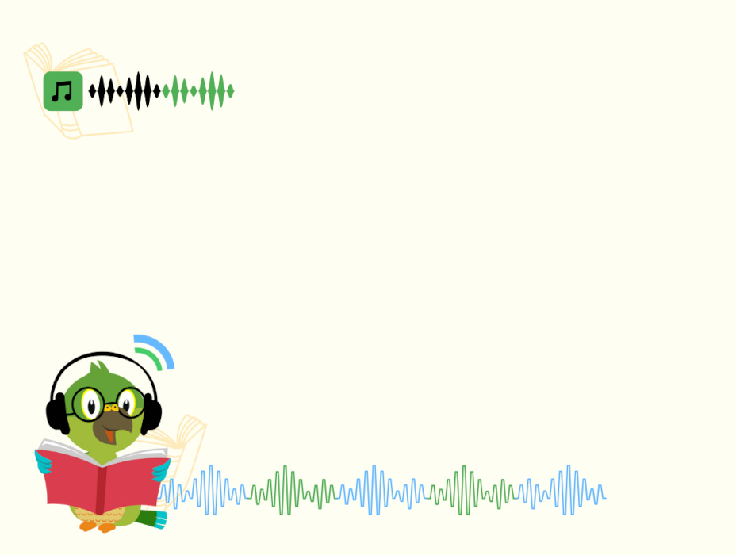
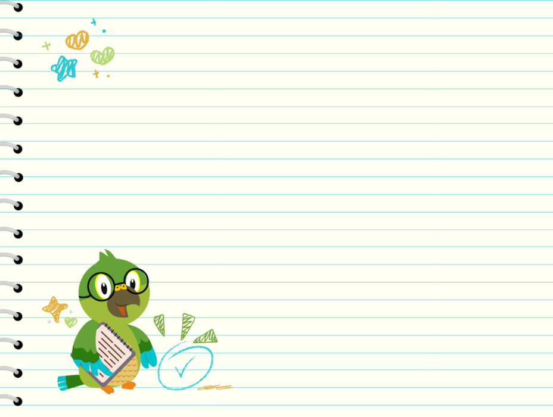
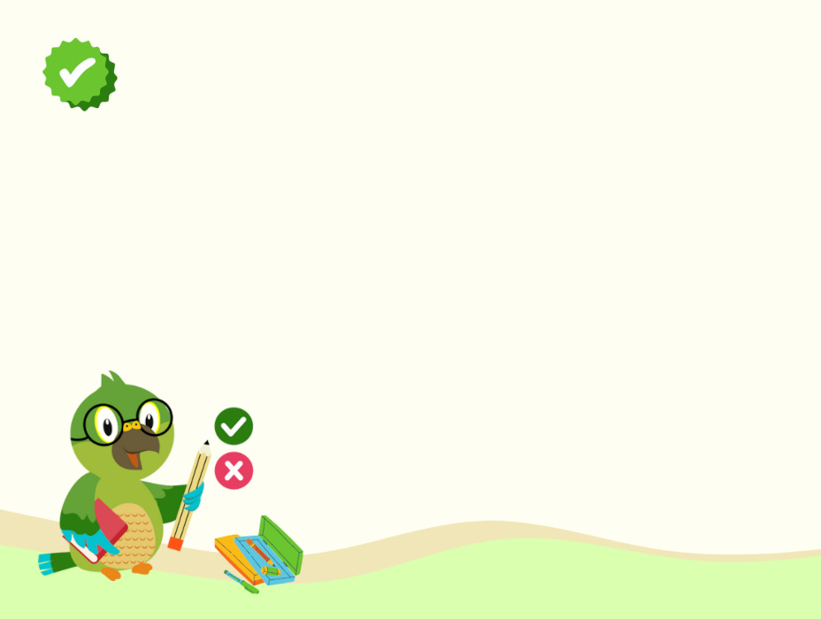
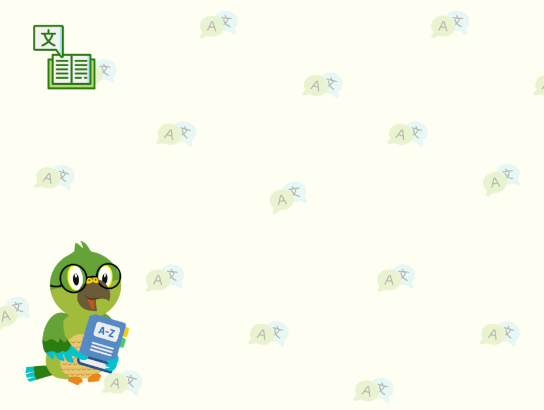
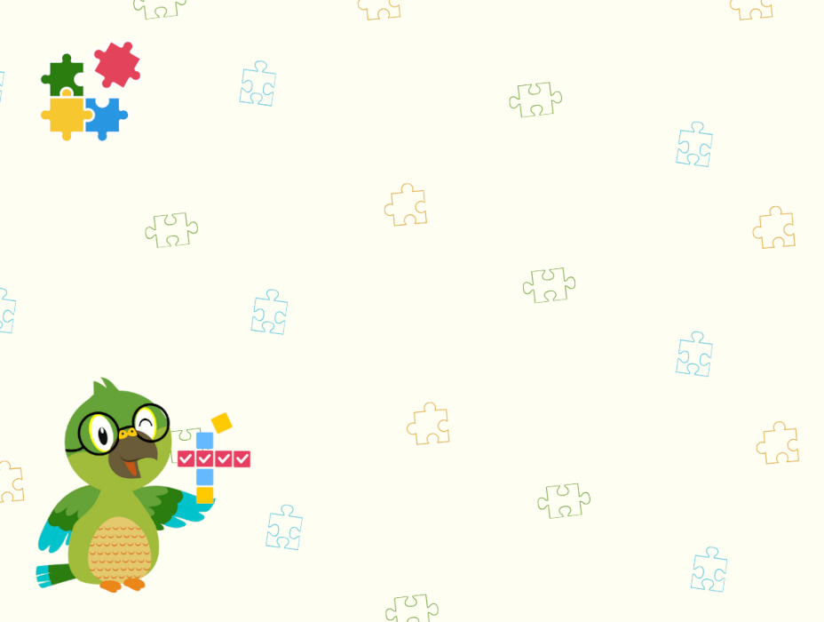
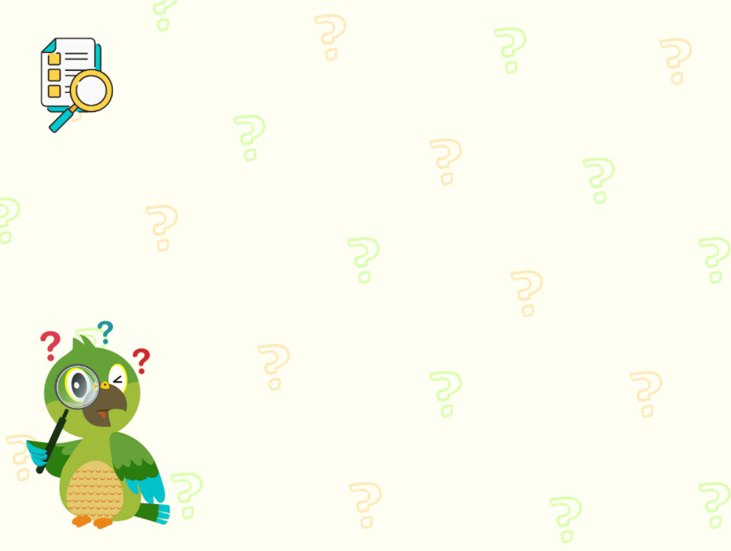

# Background Images and JSON refs

```json 
"bgData": {
  "bgImg": "konzeptes/idiom.jpg",
  "imgWidth": 928,
  "imgHeight": 700,
  "width": 500,
  "height": 650,
  "left": 250,
  "top": 20
},
```

## composition.jpg (left) comprehension.jpg (right)

<div float="left">
    
     
</div>

## grammar.jpg (left) idiom.jpg (right)

<div float="left">
    
     
</div>

## listening.jpg (left)  sentence.jpg (right)

<div float="left">
    
     
</div>

## spelling.jpg (left)  vocabulary.jpg (right)

<div float="left">
    
     
</div>

## wordbuilding.jpg (left)  wordsearch.jpg (right)

<div float="left">
    
     
</div>

